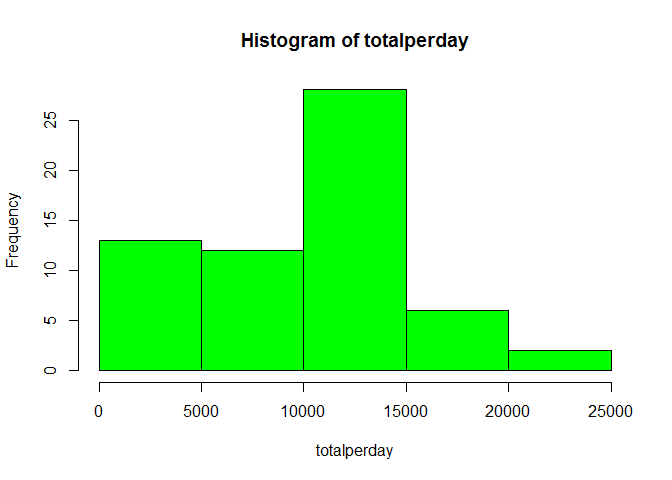
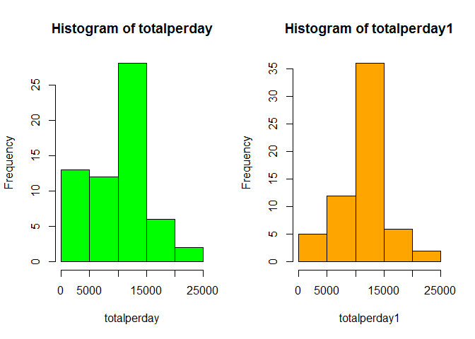

Loading and preprocessing the data
----------------------------------

    library(ggplot2)
    stepdata<-read.csv("activity.csv", head=TRUE,na.strings="NA")

What is mean total number of steps taken per day?
-------------------------------------------------

    totalperday<-tapply(stepdata$steps,stepdata$date,sum,na.rm=TRUE)
    hist(totalperday,col="green")

Mean and Median of the total number of steps taken per day
----------------------------------------------------------

Mean:

    meanperday<-mean(totalperday)
    meanperday

    ## [1] 9354.23

Median:

    medianperday<-median(totalperday)
    medianperday

    ## [1] 10395

What is the average daily activity pattern?
-------------------------------------------

Make a time series plot of the 5-minute interval (x-axis) and the
average number of steps taken, averaged across all days Which 5-minute
interval, on average across all the days in the dataset, contains the
maximum number of steps?

    intervalperday<-tapply(stepdata$steps,stepdata$interval,mean,na.rm=TRUE)
    plot(rownames(intervalperday),intervalperday)

Max interval:

    maxinterval<-which.max(intervalperday)
    names(intervalperday[maxinterval])

    ## [1] "835"

Imputing missing values
-----------------------

1.  Calculate and report the total number of missing values in
    the dataset.
2.  Devise a strategy for filling in all of the missing values in
    the dataset. Here I use the mean for that 5-minute interval over
    all days.
3.  Create a new dataset that is equal to the original dataset but with
    the missing data filled in. Make a histogram of the total number of
    steps taken each day and Calculate and report the mean and median
    total number of steps taken per day. Do these values differ from the
    estimates from the first part of the assignment? What is the impact
    of imputing missing data on the estimates of the total daily number
    of steps?

Number of NAs:

    sum(is.na(stepdata$steps))

    ## [1] 2304

Fill the NAs:

    a<-which(is.na(stepdata$steps))
    b<-stepdata$interval[which(is.na(stepdata$steps))]
    b<-as.character(b)
    c<-intervalperday[b]
    stepdata1<-stepdata
    stepdata1$steps[a]<-c

Mean of the new data set without NAs:

    totalperday1<-tapply(stepdata1$steps,stepdata1$date,sum,na.rm=TRUE)
    meanperday1<-mean(totalperday1)
    meanperday1

    ## [1] 10766.19

Median of the new data set without NAs:

    medianperday1<-median(totalperday1)
    medianperday1

    ## [1] 10766.19

Histogram of the new dataset mean total steps per day without NAs
(right, orange) compared with the original one (left, green):

    par(mfrow=c(1,2))
    hist(totalperday,col="green")
    hist(totalperday1,col="orange")

Are there differences in activity patterns between weekdays and weekends?
-------------------------------------------------------------------------

1.  Create a new factor variable in the dataset with two levels -
    "weekday" and "weekend" indicating whether a given date is a weekday
    or weekend day.
2.  Make a panel plot containing a time series plot of the 5-minute
    interval (x-axis) and the average number of steps taken, averaged
    across all weekday days or weekend days (y-axis).

<!-- -->

    stepdata1$date<-as.Date(stepdata1$date)
    stepdata1$weekdays<-weekdays(stepdata1$date)
    weekday <- c('Monday', 'Tuesday', 'Wednesday', 'Thursday', 'Friday')
    weekend <- c('Saturday', 'Sunday')
    stepdata1$level<-stepdata1$weekdays
    stepdata1[(stepdata1$weekdays) %in% weekday,]$level<-"Weekday"
    stepdata1[(stepdata1$weekdays) %in% weekend,]$level<-"Weekend"

Panel Plot:

    stepdata1_intervalperday<-aggregate(steps~level+interval,data=stepdata1,mean)
    g<-ggplot(stepdata1_intervalperday,aes(interval,steps))
    g<-g+geom_line()+facet_wrap(~level,ncol=1)+theme(strip.text.x=element_text(size=10,angle=0),strip.background=element_rect(fill="wheat2"))+
      xlab("Interval")+ylab("Number of steps")
    print(g)

